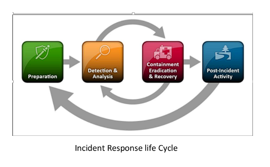

# Grok Patterns

**Grok** is one of the popular Logstash filters which is used to parse the unstructured log data to a meaningful format.

## Grok Syntax:


% { SYNTAX : SEMANTIC }


Syntax is the GROK Pattern

Semantic is the key

## Oniguruma Syntax:


( ?\<FIELD\_NAME> REGEX\_PATTERN )


field\_name is the key

regex\_pattern is the placeholder to add our regex

## Main idea:

Grok has some predefined patterns we can use but when we want a custom regex and GROK doesnt handle it, we have to settle with onigurama Syntax, hence the whole pattern is the combination of existing grok patterns + onigurama.

## Log Example:

<pre data-overflow="wrap"><code><strong>09:33:45,416 (metrics-logger-reporter-1-thread-1) type=GAUGE, name=notifications.received, value=2
</strong>
</code></pre>

From the example, the required fields and their values are:

| Field     | Value                              |
| --------- | ---------------------------------- |
| timestamp | 09:33:45,416                       |
| logthread | metrics-logger-reporter-1-thread-1 |
| type      | GAUGE                              |
| name      | notifications.received             |
| value     | 2                                  |

From the above fields, all the fields have pre-existing data types in GROK aside from logthread.

| Field     | GROK Datatype |
| --------- | ------------- |
| timestamp | %{TIME}       |
| type      | %{DATA}       |
| name      | %{DATA}       |
| value     | %{POSINT}     |

So we only need to use oniguruma for the logthread field.

The target regex value is:

<pre><code><strong>(metrics-logger-reporter-1-thread-1)
</strong></code></pre>

So our main requirements are:

* a parenthesis at the beginning and end
* some alphabets
* some digits
* hyphen sign (-)

Hence, the regex can be:

```
(?:[()\w-]+)
// \w = alphanumeric characters
```

or

```
(?:[()A-Za-z\d-]+)
```


In the above regexes, the ?: represents a non-capturing group, basically when we use oniguruma syntax, we are specifying it with a name to save to, thus we dont need to have another capturing group in the actual regex.


Finally, the Oniguruma version the field logthread becomes:

```
(?<logthread>(?:[()\w-]+))
// field_name = logthread
// regex_pattern = (?:[()\w-]+)
```

### The final pattern:

By combining the GROK + oniguruma versions we make the following pattern:


```
%{TIME:timestamp} \((?<logthread>(?:[()\w-]+))\) type=%{DATA:type}, name=%{DATA:name}, value=%{POSINT:value}
 
 // syntax = TIME (built-in GROK)
 // semantic = timestamp (the name we are giving)
 // we had to escape the parenthesis in order to avoid it in the final result
```


Finally, testing this with GROK debugger:

<figure><figcaption></figcaption></figure>

The output:

```javascript
[
  {
    "timestamp": "09:33:45,416",
    "logthread": "metrics-logger-reporter-1-thread-1",
    "type": "GAUGE",
    "name": "notifications.received",
    "value": 2
  },
  null
]
```
